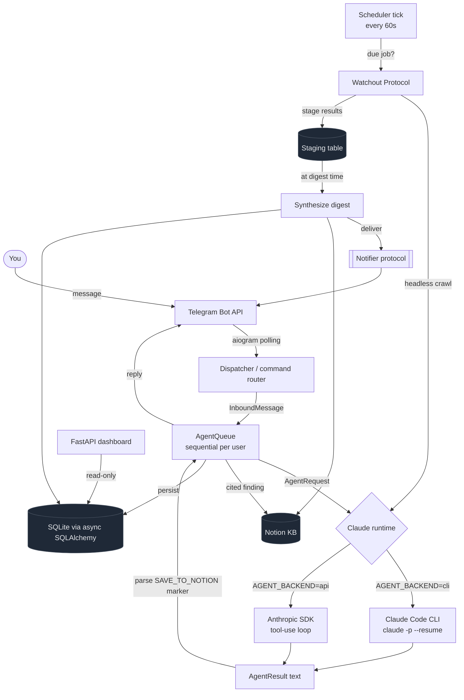

# Gisst

**A self-hosted, Claude-powered personal agent that lives in Telegram and does your research for you, on a schedule, with a cited Notion knowledge base.**

[](https://www.python.org/downloads/)
[](./LICENSE)
[](https://github.com/astral-sh/ruff)
[](https://mypy-lang.org/)
[](#development)
[](https://docs.astral.sh/ruff/formatter/)

---

## Table of Contents

- [What is this?](#what-is-this)
- [Features](#features)
- [Architecture](#architecture)
- [Two interchangeable Claude runtimes](#two-interchangeable-claude-runtimes)
- [The Watchout Protocol](#the-watchout-protocol)
- [Tech stack](#tech-stack)
- [Quickstart](#quickstart)
- [Configuration](#configuration)
- [Project layout](#project-layout)
- [Telegram command reference](#telegram-command-reference)
- [Running the dashboard](#running-the-dashboard)
- [Development](#development)
- [Design notes](#design-notes)
- [Roadmap](#roadmap)
- [License](#license)

---

## What is this?

Gisst is my take on [**OpenClaw**](https://github.com/openclaw/openclaw): the ~300k-star, self-hosted
personal AI agent that plugs into your messaging apps and acts on your behalf. OpenClaw is a brilliant
general-purpose assistant. Gisst borrows the same self-hosted, "one brain living in your chat app"
philosophy and points it at a single job that it does deeply: **continuous, autonomous research.**

You talk to Gisst in Telegram the way you would a sharp research analyst. Ask it something and it runs a
real Claude agent loop (web search, fetch, synthesize) and answers with citations. The interesting part
is what happens when you stop watching: tell Gisst to *keep an eye on* a topic and it spins up a
recurring research job (the **Watchout Protocol**). It crawls on a cadence, stages what it finds, and
delivers a synthesized daily digest back to your chat. Every finding worth keeping is written to a
**Notion knowledge base** as a cited, structured page, so your research compounds instead of scrolling
away.

**Where it sits in the category.** Claude Code, OpenHands, Cline, and OpenClaw are all excellent
interactive agents: you prompt, they act, you read the answer. None of them are built around
*scheduled, autonomous research that accumulates into a cited knowledge base you own.* That gap is the
entire reason Gisst exists. It is not a reimplementation of OpenClaw; it is an OpenClaw-style agent
purpose-built for one capability the others do not have.

It is fully self-hosted: your bot token, your Notion workspace, your database, your Claude key or your
Claude Code subscription. Nothing routes through a third party.

---

## Features

- **Lives in Telegram.** Talk to it in a DM or add it to a group. Per-user, per-session conversation
  memory via resumable Claude sessions, so it remembers the thread.
- **Real research, not autocomplete.** Each query drives a Claude agent loop with web search and fetch.
  Answers come back synthesized and cited, not hallucinated.
- **The Watchout Protocol.** Schedule recurring research on any topic with a natural cadence
  (`every 4h`, `daily`). Gisst crawls, stages, and digests automatically.
- **A Notion knowledge base that builds itself.** Findings worth keeping are pushed to Notion as
  structured, cited pages. The Research Findings and Daily Digests databases are auto-provisioned on
  first boot under a parent page you choose.
- **Two interchangeable Claude backends.** Run on the Claude Code CLI (uses your subscription, zero API
  cost) or on the native Anthropic SDK agent loop (pure API, no CLI dependency). Flip one env var.
- **Built-in scheduler.** An APScheduler tick checks for due crawls and digests. No external cron, no
  webhooks, no extra services.
- **FastAPI observability dashboard.** A read-only web view over the database: findings, digests, active
  jobs, and live counts.
- **Self-hosted and durable.** Async SQLAlchemy over SQLite (WAL mode) for the prototype, with Alembic
  migrations and a clean path to Postgres. Everything is yours.
- **Configurable persona.** Tune the agent's identity, tone, research depth, source preferences, and
  scheduling defaults through a structured profile. A two-layer prompt keeps the core behaviour stable
  while the persona stays dynamic.

---

## Architecture



The dependency graph is deliberately acyclic. The scheduler never imports Telegram: it depends on the
narrow `Notifier` protocol and the composition root injects the concrete Telegram implementation. The
agent core never imports Telegram either; it speaks in channel-agnostic `InboundMessage` /
`OutboundMessage` models. One brain, many surfaces.

---

## Two interchangeable Claude runtimes

Both backends implement the same `AgentRuntime` protocol (`name`, `async run(AgentRequest) ->
AgentResult`), so everything above the runtime (marker parsing, Notion sync, the queue) is identical no
matter which one you pick. You choose with a single env var, `AGENT_BACKEND`.

| | `cli` (default) | `api` |
| --- | --- | --- |
| **Driver** | Shells out to the Claude Code CLI (`claude -p`) | Native Anthropic Python SDK agent loop |
| **Session memory** | `--resume` against a persisted session id | Conversation state threaded by the queue |
| **Tools** | Everything the CLI exposes (web search, fetch, files) | `WebSearch` / `WebFetch` tool-use, capped at `AGENT_MAX_TURNS` |
| **Cost model** | Uses your Claude Code subscription, no per-token billing | Pay-as-you-go via `ANTHROPIC_API_KEY` |
| **Best for** | Local or VM hosting where the CLI is installed | Containerized / serverless deploys with no CLI |

Headless Watchout crawls run through the exact same runtime with `headless=True`, so a background crawl
and a foreground chat share one code path. Swapping backends is a config change, never a rewrite.

---

## The Watchout Protocol

The Watchout Protocol is Gisst's autonomous research engine. It turns "keep an eye on X for me" into a
durable, self-running job.

1. **Schedule.** You define a job with `/schedule` (a topic, a cadence like `every 4h`, and a digest
   time like `20:00`). It is persisted as a `ScheduleJobState` with its delivery chat and run history.
2. **Crawl.** Every scheduler tick (default 60s) checks each active job's cadence against its last-crawl
   time. When a crawl is due, Gisst runs a **headless** Claude agent over the topic and keywords,
   looking back over the configured window (`24h` by default).
3. **Stage.** Crawl output is written to a staging table, partitioned by job and day, so findings
   accumulate between digests instead of spamming your chat on every tick.
4. **Digest.** At the job's digest time, Gisst pulls the day's staged findings, asks Claude to
   synthesize them into one coherent briefing, and delivers it to your Telegram chat through the
   `Notifier` protocol. The digest is also written to Notion and recorded in the database. The staging
   slot for that day is then cleared.

The result: you set it once, and a cited briefing lands in your chat on schedule while the underlying
findings pile up in a knowledge base you own.

---

## Tech stack

| Layer | Choice | Why |
| --- | --- | --- |
| **Package / env** | [uv](https://github.com/astral-sh/uv) | Fast, reproducible installs and a single lockfile |
| **Telegram** | [aiogram v3](https://docs.aiogram.dev/) | Modern fully-async Bot API framework, long-polling |
| **LLM** | [anthropic](https://github.com/anthropics/anthropic-sdk-python) SDK + Claude Code CLI | Dual interchangeable runtimes |
| **Knowledge base** | [notion-client](https://github.com/ramnes/notion-sdk-py) | Auto-provisioned, cited Notion databases |
| **Scheduler** | [APScheduler](https://apscheduler.readthedocs.io/) 3.x | In-process recurring jobs, no external cron |
| **Persistence** | [SQLAlchemy 2.0](https://www.sqlalchemy.org/) async + [aiosqlite](https://github.com/omnilib/aiosqlite) + [Alembic](https://alembic.sqlalchemy.org/) | Async ORM, WAL SQLite now, Postgres-ready, versioned migrations |
| **Config** | [pydantic-settings](https://docs.pydantic.dev/latest/concepts/pydantic_settings/) | Typed, grouped, env-driven settings |
| **Dashboard** | [FastAPI](https://fastapi.tiangolo.com/) + [uvicorn](https://www.uvicorn.org/) + [Jinja2](https://jinja.palletsprojects.com/) | Read-only observability over the DB |
| **Logging** | [structlog](https://www.structlog.org/) | Structured logs, pretty in dev, JSON in prod |
| **Quality** | [ruff](https://docs.astral.sh/ruff/) + [mypy](https://mypy-lang.org/) + [pytest](https://docs.pytest.org/) | Lint, format, strict types, async tests |

---

## Quickstart

You need Python 3.11+ and a Telegram bot token from [@BotFather](https://t.me/BotFather). To use the
default `cli` backend, install the [Claude Code CLI](https://docs.anthropic.com/en/docs/claude-code) and
make sure `claude` is on your `PATH`. Otherwise set `AGENT_BACKEND=api` and provide an
`ANTHROPIC_API_KEY`.

```bash
# 1. Install dependencies into a managed virtualenv
uv sync

# 2. Create your env file and fill in at least TELEGRAM_BOT_TOKEN
cp .env.example .env
$EDITOR .env

# 3. Run the agent (starts the bot + scheduler + optional dashboard + Notion setup)
uv run python -m gisst
```

Only `TELEGRAM_BOT_TOKEN` is strictly required to boot. Notion and the dashboard are optional and
degrade gracefully if their credentials are absent. Message your bot, and you are live.

---

## Configuration

Everything is driven by environment variables (loaded from `.env`). Settings are grouped by concern:
`settings.telegram`, `settings.agent`, `settings.notion`, `settings.database`, `settings.scheduler`,
`settings.api`, `settings.observability`.

| Variable | Default | Description |
| --- | --- | --- |
| `GISST_ENV` | `dev` | `dev` or `prod`. Controls log format and verbosity. |
| `TELEGRAM_BOT_TOKEN` | _(required)_ | Bot token from @BotFather. The only strictly required var. |
| `AGENT_BACKEND` | `cli` | Claude runtime: `cli` (Claude Code CLI) or `api` (Anthropic SDK). |
| `CLAUDE_MODEL` | `claude-sonnet-4-6` | Model the agent runs on. |
| `ANTHROPIC_API_KEY` | _(empty)_ | Required only when `AGENT_BACKEND=api`. |
| `AGENT_TIMEOUT` | `300` | Seconds allowed per agent run. |
| `AGENT_MAX_TURNS` | `12` | Max tool-use turns for the `api` backend. |
| `GISST_WORK_DIR` | `./data/workspace` | Working directory the agent operates in. |
| `GISST_DATA_DIR` | `./data` | Root for the JSON store and SQLite database. |
| `DATABASE_URL` | `sqlite+aiosqlite:///./data/gisst.db` | Async SQLAlchemy database URL. |
| `NOTION_API_KEY` | _(empty)_ | Notion integration token. Enables the knowledge base. |
| `NOTION_PAGE_ID` | _(empty)_ | Parent page under which databases are auto-provisioned. |
| `NOTION_RESEARCH_DB_ID` | _(auto)_ | Filled in after first boot. |
| `NOTION_DIGEST_DB_ID` | _(auto)_ | Filled in after first boot. |
| `NOTION_VERSION` | `2022-06-28` | Notion API version pin. |
| `SCHEDULER_TICK_SECONDS` | `60` | How often the scheduler checks for due jobs. |
| `SCHEDULER_ENABLED` | `true` | Master switch for the Watchout Protocol. |
| `API_ENABLED` | `true` | Whether the FastAPI dashboard starts. |
| `API_HOST` | `0.0.0.0` | Dashboard bind host. |
| `API_PORT` | `8000` | Dashboard bind port. |
| `LOG_LEVEL` | `INFO` | Log level. |
| `LOG_JSON` | `false` | `true` for JSON logs (prod), `false` for pretty console (dev). |

Notion and the dashboard are optional: leave their credentials blank and Gisst runs as a
Telegram-only research agent.

---

## Project layout

```text
gisst/
├-- README.md
├-- CLAUDE.md                  <- project brief for the agent working on this repo
├-- pyproject.toml             <- deps, ruff, mypy, pytest config
├-- .env.example
├-- LICENSE
├-- knowledge/                 <- project knowledge base (changelog, design, todos, ops)
└-- src/gisst/                 <- the package (src layout, import as `from gisst.x import y`)
    ├-- __main__.py            <- entry point: wires bot + scheduler + dashboard + Notion
    ├-- config.py              <- grouped pydantic-settings; get_settings() singleton
    ├-- constants.py           <- marker tags, limits, defaults
    ├-- logging.py             <- structlog setup; get_logger("subsystem.name")
    ├-- models/                <- framework-agnostic Pydantic domain models
    |   ├-- agent.py           <- AgentProfile, identity / research / interaction / schedule
    |   ├-- messaging.py       <- InboundMessage, OutboundMessage, ChatType
    |   ├-- research.py        <- ResearchFinding, ResearchSource, CrawlFinding, Stored* read models
    |   └-- schedule.py        <- ScheduleJob, ScheduleJobState, StagedFinding
    ├-- core/                  <- cross-cutting protocols (Notifier) and utils (split_message)
    ├-- agent/
    |   ├-- markers.py         <- parse the [SAVE_TO_NOTION: {...}] marker out of agent output
    |   ├-- prompt.py          <- two-layer prompt: base DNA + persona layer + Watchout prompts
    |   ├-- queue.py           <- per-user sequential message queue over the runtime
    |   └-- runtime/
    |       ├-- base.py        <- AgentRuntime protocol, AgentRequest, AgentResult
    |       ├-- cli.py         <- Claude Code CLI backend
    |       └-- api.py         <- Anthropic SDK backend
    ├-- telegram/              <- aiogram bot, command router, Notifier implementation
    ├-- notion/                <- Notion client, schema auto-provisioning, sync
    ├-- scheduler/             <- APScheduler loop, Watchout crawl -> stage -> digest
    ├-- api/                   <- FastAPI observability dashboard
    └-- db/
        ├-- base.py            <- declarative Base
        ├-- engine.py          <- async engine + session factory (SQLite WAL pragmas)
        ├-- models.py          <- SQLAlchemy ORM tables
        └-- repositories.py    <- typed repository layer over the DB
```

---

## Telegram command reference

| Command | What it does |
| --- | --- |
| `/start` | Introduce the agent and show what it can do. |
| `/register` | Opt the current group in. Gisst only acts in DMs and registered groups. |
| `/schedule <topic> [cadence] [time]` | Create a Watchout job, for example `/schedule "AI agent funding" every 4h 20:00`. |
| `/schedules` | List the Watchout jobs for this chat with their ids, cadence, and status. |
| `/pause <id>` | Toggle a job active or paused by its short id. |
| `/remove <id>` | Delete a Watchout job by its short id. |

Outside of commands, just talk to it: any normal message in a DM or registered group is treated as a
research request and answered by the agent.

---

## Running the dashboard

When `API_ENABLED=true` (the default), Gisst starts a FastAPI app alongside the bot and scheduler. It is
a read-only window onto the database, so you can see what your agent has been doing without opening
Notion or the SQLite file.

```bash
# Started automatically by `python -m gisst`; then visit:
open http://localhost:8000
```

It surfaces the `Repositories.stats()` rollup (findings, digests, active jobs, total jobs, registered
groups) plus the recent findings and digests feeds. Bind host and port are configurable via `API_HOST`
and `API_PORT`.

---

## Development

```bash
uv sync --extra dev      # install dev tooling (ruff, mypy, pytest)

make lint                # ruff check + ruff format --check
make typecheck           # mypy (strict: disallow_untyped_defs)
make test                # pytest (asyncio_mode = auto)
```

Or invoke the tools directly:

```bash
uv run ruff check src tests
uv run ruff format src tests
uv run mypy
uv run pytest
```

The project targets a 100-character line length, the full ruff lint set (`E W F I B C4 UP SIM RUF`),
strict mypy with the pydantic plugin, and `pytest-asyncio` in auto mode.

---

## Design notes

> **Dual-backend runtime.** The CLI and API backends sit behind one `AgentRuntime` protocol. Marker
> parsing, Notion sync, and the message queue live *above* the runtime, so they are written once and
> work for both. Switching from "uses my Claude subscription via the CLI" to "pure Anthropic API" is a
> one-line config change, never a code change.

> **The Notifier protocol decoupling.** The scheduler produces digests but must not know how they are
> delivered. It depends on the narrow `Notifier` protocol (`async send_text(chat_id, text)`), and the
> composition root injects the Telegram implementation. This keeps the dependency graph acyclic
> (`scheduler -> core.Notifier`, never `scheduler -> telegram`) and makes adding a second delivery surface
> a matter of writing one adapter.

> **JSON to SQLAlchemy migration.** The original prototype stored everything in JSON files. This
> rewrite moves persistence to async SQLAlchemy 2.0 over SQLite (WAL mode) with Alembic migrations,
> while keeping the domain models as Pydantic. The repository layer is the seam: callers receive typed
> domain models and never touch the ORM, so the same code runs unchanged when the backing store moves to
> Postgres.

---

## Roadmap

- **Postgres backend.** The async SQLAlchemy + repository layer already abstracts this; just point
  `DATABASE_URL` at Postgres and run the Alembic migrations.
- **Multi-agent profiles.** The `AgentProfile` model and profile id are scaffolded for several personas
  per deployment; the prototype ships one (`Scout`).
- **More surfaces.** The channel-agnostic messaging models and `Notifier` protocol are built to host a
  second adapter (Slack, Discord, WhatsApp) without touching the agent core.
- **Richer dashboard.** Trend views, per-job timelines, and on-demand crawl triggers from the web UI.
- **Smarter cadence parsing.** Natural-language schedules beyond `every Nh` and `daily`.

---

## License

[MIT](./LICENSE) © 2026 Sahil Mandi
