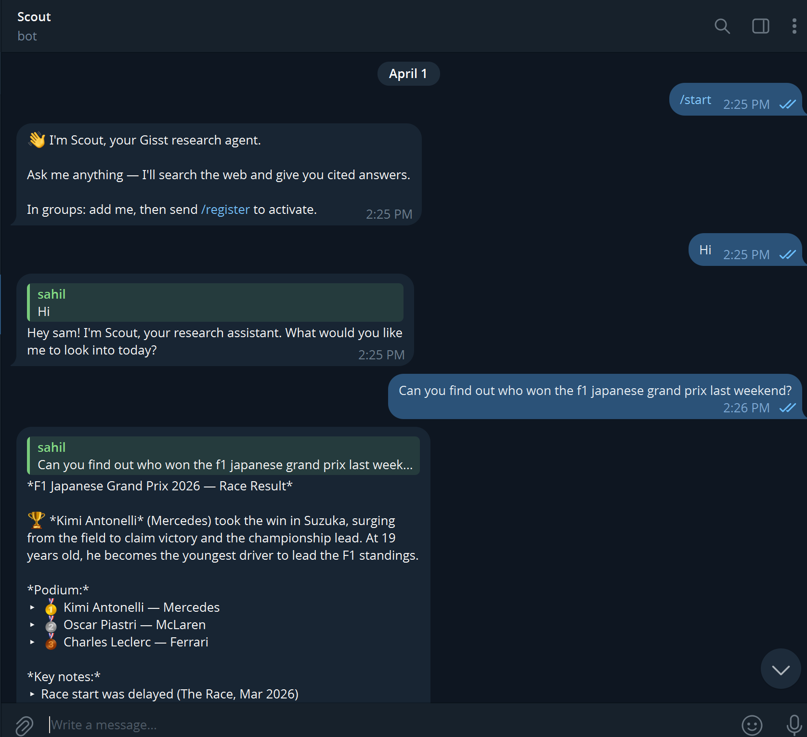
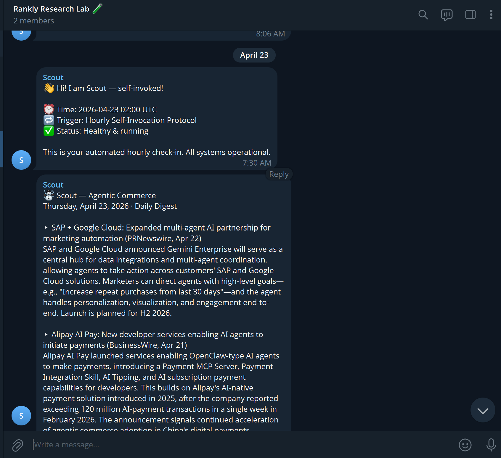
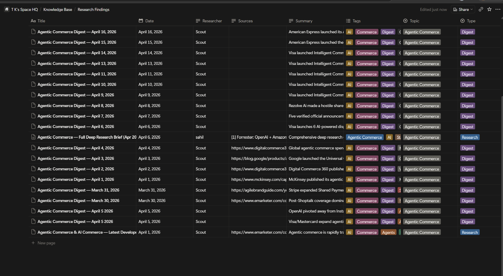
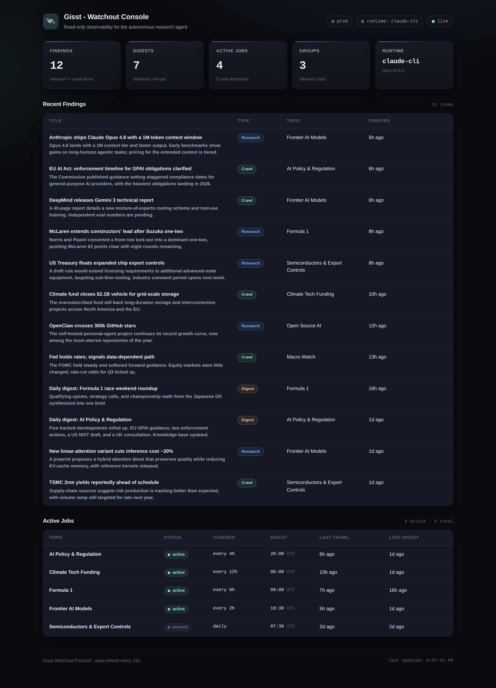

# Gisst: Async Python AI Research Agent



A self-hosted research agent that lives in Telegram, built as a single-process,
fully **async Python 3.12 / asyncio** application. You talk to it like a research
analyst: ask a question and it runs a real **Claude agent loop** (web search,
fetch, synthesize) and answers with citations. Tell it to *keep an eye on* a
topic and it spins up a recurring, autonomous research job (the **Watchout
Protocol**) that crawls on a cadence, stages findings, and delivers a synthesized
daily digest back to your chat. Every finding worth keeping is mirrored into a
**Notion knowledge base** as a cited, structured page.

It is my take on **[OpenClaw](https://github.com/openclaw/openclaw)** (the
~300k-star self-hosted personal-agent project), narrowed to one job it does
deeply: continuous, cited research. The stack is **aiogram v3**, the **Anthropic
SDK** and the **Claude Code CLI** (two interchangeable runtimes behind one
protocol), **APScheduler**, **SQLAlchemy 2.0 async + Alembic**,
**pydantic-settings**, **structlog**, and a read-only **FastAPI** dashboard. All
of it runs on a single event loop. Typed, `ruff`/`mypy`-clean, 59 tests green.

---

## Architecture at a glance

```
                          Telegram  (aiogram v3, long-polling)
                                      │
                                      ▼   commands + free text, group gating
                          ┌───────────────────────┐
                          │   Dispatcher / routers │
                          └───────────┬───────────┘
                                      │  per user: sequential; parallel across users
                                      ▼
                          ┌───────────────────────┐      [SAVE_TO_NOTION: {...}]
                          │      AgentQueue        │ ──────────────────────────────┐
                          └───────────┬───────────┘                                │
                                      │  AgentRequest                              ▼
                        ┌─────────────┴─────────────┐                      Notion sync
                        ▼                           ▼            (Research / Digest databases,
               ClaudeCliRuntime            AnthropicApiRuntime    auto-provisioned on first boot)
              (claude -p, --resume)     (Anthropic SDK, web_search)
                        └─────────────┬─────────────┘
                                      │  AgentResult (text + session_id)
                                      ▼
                            marker parse  ─►  reply (chunked, Markdown)

   APScheduler tick (60s) ─► Watchout:  crawl ─► staging (per job/day) ─► daily digest
                                                                              │
                                          Telegram (Notifier protocol)  ◄─────┴─────►  Notion

   FastAPI dashboard  ──read-only──►  SQLAlchemy 2.0 async (sqlite+aiosqlite)  ◄── Repositories
                       Alembic migrations · structlog · pydantic-settings
                       one asyncio event loop for the bot, scheduler, and API
```

---

## Subsystems

| Module | Layer | Responsibility |
| ------ | ----- | -------------- |
| `config` / `logging` | spine | pydantic-settings config groups; structlog (pretty in dev, JSON in prod) |
| `models` | spine | Pydantic domain contracts shared by every layer |
| `db` | spine | async SQLAlchemy 2.0 engine, ORM tables, repository layer, Alembic |
| `core` | protocols | `Notifier` protocol + Telegram-aware text splitter |
| `agent.runtime` | agent | two interchangeable Claude backends behind one protocol, plus a factory |
| `agent` | agent | two-layer prompt engine, profile store, per-user queue, `SAVE_TO_NOTION` parser |
| `telegram` | channel | aiogram v3 bot, command + message routers, group registration / mention gating |
| `notion` | integration | async client, auto-provisioned databases, finding / crawl / digest sync |
| `scheduler` | integration | APScheduler tick, cadence math, Watchout crawl to digest pipeline |
| `api` | surface | read-only FastAPI observability dashboard |
| `app` | root | composition root wiring every subsystem on one event loop |

---

## Tech stack: what every resume bullet maps to

| Resume bullet | Where in code |
| ------------- | ------------- |
| Fully async Python app on a single asyncio event loop | [src/gisst/app.py](src/gisst/app.py) |
| Typed config from env via pydantic-settings (nested groups) | [config.py](src/gisst/config.py) |
| Pluggable agent runtime (Strategy pattern behind a `Protocol`) | [runtime/base.py](src/gisst/agent/runtime/base.py) + [factory.py](src/gisst/agent/runtime/factory.py) |
| Claude Code **CLI** backend with resumable sessions (`--resume`) | [runtime/cli.py](src/gisst/agent/runtime/cli.py) |
| Native **Anthropic SDK** agent loop with hosted web-search tool-use | [runtime/api.py](src/gisst/agent/runtime/api.py) |
| Two-layer prompt engine (hardcoded base DNA + dynamic user profile) | [agent/prompt.py](src/gisst/agent/prompt.py) |
| Robust marker parser (balanced-brace JSON scan, not regex) | [agent/markers.py](src/gisst/agent/markers.py) |
| Per-user async work queue (sequential per user, parallel across users) | [agent/queue.py](src/gisst/agent/queue.py) |
| **Async SQLAlchemy 2.0** (aiosqlite) + repository pattern | [db/engine.py](src/gisst/db/engine.py) + [db/repositories.py](src/gisst/db/repositories.py) |
| Schema migrations (async Alembic) | [migrations/env.py](migrations/env.py) + [migrations/versions/0001_initial.py](migrations/versions/0001_initial.py) |
| **aiogram v3** bot, routers, group gating, mention/reply detection | [telegram/bot.py](src/gisst/telegram/bot.py) + [routers/messages.py](src/gisst/telegram/routers/messages.py) |
| `Notifier` protocol to keep the dependency graph acyclic | [core/notifier.py](src/gisst/core/notifier.py) |
| **Notion** client + auto-provisioned databases + sync | [notion/client.py](src/gisst/notion/client.py) + [notion/schema.py](src/gisst/notion/schema.py) + [notion/sync.py](src/gisst/notion/sync.py) |
| **APScheduler** AsyncIOScheduler + cadence math | [scheduler/service.py](src/gisst/scheduler/service.py) + [scheduler/cadence.py](src/gisst/scheduler/cadence.py) |
| Scheduled crawl to staging to daily digest pipeline | [scheduler/watchout.py](src/gisst/scheduler/watchout.py) |
| Read-only **FastAPI** dashboard (HTML + JSON + OpenAPI) | [api/app.py](src/gisst/api/app.py) |
| Structured logging (structlog, stdlib bridge) | [logging.py](src/gisst/logging.py) |
| pytest suite (59 tests, async) | [tests/](tests/) |
| CI: ruff + mypy + pytest matrix (3.11 / 3.12) | [.github/workflows/ci.yml](.github/workflows/ci.yml) |
| Containerized stack | [Dockerfile](Dockerfile) + [docker-compose.yml](docker-compose.yml) |

### Why two interchangeable Claude runtimes?

The agent never talks to Claude directly. It depends on an `AgentRuntime`
protocol with two implementations, selected by a single env var
(`AGENT_BACKEND`):

- **`cli`** shells out to the **Claude Code CLI** (`claude -p`), resuming
  per-user sessions with `--resume`. You get native WebSearch / WebFetch, file
  tools, and session persistence for free, and it runs on a Claude subscription
  with zero per-token API cost.
- **`api`** runs a native **Anthropic SDK** tool-use loop against the Messages
  API with the hosted `web_search` tool. No CLI dependency, pure API, easy to run
  anywhere.

Same `AgentRequest` in, same `AgentResult` out. Marker parsing, Notion sync, and
session storage all live *above* the runtime, so swapping backends changes one
line of config and nothing else. Picking the right backend per deployment is the
point, not unifying them.

---

## The Watchout Protocol

The Watchout Protocol is the autonomous engine. It turns "keep an eye on X" into
a durable, self-running job.

1. **Schedule.** `/schedule <topic> [every Nh] [digest HH:MM]` persists a
   `ScheduleJobState` (topic, cadence, digest time, delivery chat, run history).
2. **Crawl.** Every scheduler tick (60s) checks each active job's cadence against
   its last crawl. When due, Gisst runs a headless Claude agent over the topic
   and stages the result.
3. **Stage.** Crawl output accumulates in a staging table partitioned by job and
   day, so findings build up between digests instead of spamming the chat.
4. **Digest.** At (or just past) the job's digest time, once per day, Gisst pulls
   the day's staged findings, asks Claude to synthesize one briefing, and
   delivers it through the `Notifier` protocol. The digest is written to Notion
   and recorded in the database; the staging slot is cleared.



Every finding is mirrored to Notion, so the research compounds into a structured,
cited knowledge base you own:



---

## Running it locally

You need: **Python 3.11+** (3.12 recommended), **[uv](https://github.com/astral-sh/uv)**,
a **Telegram bot token** (from [@BotFather](https://t.me/BotFather)), and one of:
the **Claude Code CLI** installed, or an **Anthropic API key**. Notion is optional.

### 1. Install

```bash
make install          # uv sync --extra dev  (creates .venv, installs deps)
```

### 2. Configure

```bash
cp .env.example .env   # fill in at least TELEGRAM_BOT_TOKEN
```

Only `TELEGRAM_BOT_TOKEN` is required to boot. Set `AGENT_BACKEND=cli` (default)
to use the Claude Code CLI, or `AGENT_BACKEND=api` with `ANTHROPIC_API_KEY`. Add
`NOTION_API_KEY` + `NOTION_PAGE_ID` to enable the knowledge base (the databases
are created for you on first boot).

### 3. Run

```bash
make run               # python -m gisst
```

This starts the Telegram bot, the scheduler, the FastAPI dashboard, and the
one-time Notion setup, all on one event loop. Then:

- **DM the bot**, send `/start`, and ask it to research something.
- **In a group**, add the bot, send `/register`, then `/schedule AI Policy every 4h digest 20:00`.
- Open the dashboard at <http://localhost:8000>.

### 4. Develop

```bash
make test              # pytest (59 tests)
make lint              # ruff check
make typecheck         # mypy (clean)
make migrate           # alembic upgrade head
docker compose up      # full containerized run
```

---

## The observability dashboard

`python -m gisst` also serves a read-only FastAPI console at
<http://localhost:8000>. It is a window onto the agent's own database (no writes),
so you can see what it has been doing without opening Notion or the SQLite file.



It surfaces the `Repositories.stats()` rollup (findings, digests, active jobs,
registered groups, active runtime) plus the recent findings and active jobs
feeds, and auto-generates interactive OpenAPI docs at `/api/docs`.

---

## Project layout

```
gisst/
├── pyproject.toml              # deps + ruff / mypy / pytest config (uv-managed)
├── Dockerfile, docker-compose.yml
├── alembic.ini, migrations/    # async Alembic schema migrations
├── Makefile                    # install / run / test / lint / typecheck / migrate
├── .github/workflows/ci.yml    # ruff + mypy + pytest on 3.11 and 3.12
├── docs/                       # ARCHITECTURE, getting-started, configuration, ...
├── knowledge/                  # build log: changelogs, design notes, open questions
├── tests/                      # pytest suite (59 tests)
└── src/gisst/
    ├── __main__.py, app.py     # entry point + composition root (one event loop)
    ├── config.py, logging.py   # pydantic-settings + structlog
    ├── models/                 # Pydantic domain contracts
    ├── core/                   # Notifier protocol + text splitter
    ├── db/                     # async SQLAlchemy engine, ORM, repositories
    ├── agent/
    │   ├── runtime/            # cli.py + api.py + factory.py (two backends)
    │   ├── prompt.py           # two-layer prompt (base DNA + user profile)
    │   ├── profile.py          # persona persistence
    │   ├── queue.py            # per-user async work queue
    │   └── markers.py          # SAVE_TO_NOTION balanced-brace parser
    ├── telegram/               # aiogram v3 bot, routers, notifier, middleware
    ├── notion/                 # client + auto-provisioned databases + sync
    ├── scheduler/              # APScheduler service + cadence + Watchout pipeline
    └── api/                    # FastAPI observability dashboard
```

The whole app is one installable package (`src` layout). `python -m gisst` boots
everything; there is nothing else to wire up.

---

## Notable design choices

- **One event loop, no thread-pool bridging.** aiogram, APScheduler's
  `AsyncIOScheduler`, the async Anthropic client, async SQLAlchemy, and uvicorn
  all share a single asyncio loop. This is why the all-async library picks matter.
- **The scheduler never imports the Telegram adapter.** Digest delivery goes
  through a `Notifier` protocol that the composition root injects, so the
  dependency graph stays acyclic (`scheduler -> core.Notifier`, never
  `scheduler -> telegram`). Adding a Slack or Discord channel is a new `Notifier`,
  not a rewrite.
- **Two-layer prompt.** A hardcoded base "DNA" (cite-or-silence research agent,
  Telegram formatting rules, the `SAVE_TO_NOTION` contract) plus a user layer
  rendered from a `AgentProfile` (tone, depth, topics, schedule).
- **JSON store replaced by async SQLAlchemy.** The original prototype kept state
  in JSON files; this rewrite uses SQLAlchemy 2.0 + a repository layer that never
  leaks ORM objects past its boundary, with Alembic migrations.
- **Digest timing is at-or-past, once per day.** A tick that lands a minute late
  still delivers; a guard on `last_digest`'s date prevents double-sends. See
  [scheduler/cadence.py](src/gisst/scheduler/cadence.py).
- **Notion databases are auto-provisioned.** On first boot Gisst creates the
  Research Findings and Daily Digests databases under a parent page and persists
  their ids, so setup is one env var, not manual schema work.

---

## What's intentionally not built (yet)

- **Single agent profile.** Multi-profile support is scaffolded
  (`AgentProfile.id`), but the prototype ships one persona ("Scout").
- **SQLite by default.** The engine is async SQLAlchemy, so Postgres is a
  `DATABASE_URL` change plus `aiosqlite -> asyncpg`; nothing else moves.
- **Long-polling, not webhooks.** Simpler to self-host; a webhook transport is a
  drop-in on the aiogram side.
- **One channel.** Telegram is the only surface today. The `Notifier` protocol
  and channel-agnostic `InboundMessage` model exist so others can be added.
- **Stateless API backend.** The Anthropic SDK runtime does not replay prior
  context across calls (the CLI backend does, via `--resume`).
- **No research-quality eval harness.** Citation coverage and dedup are enforced
  by the prompt, not yet measured by an automated suite.

---

## License

MIT.
