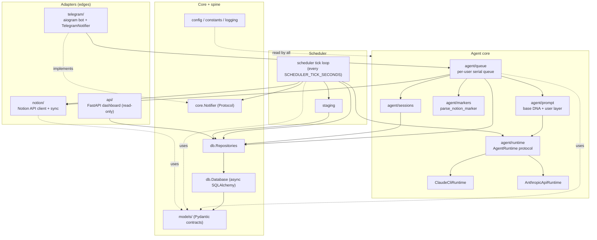
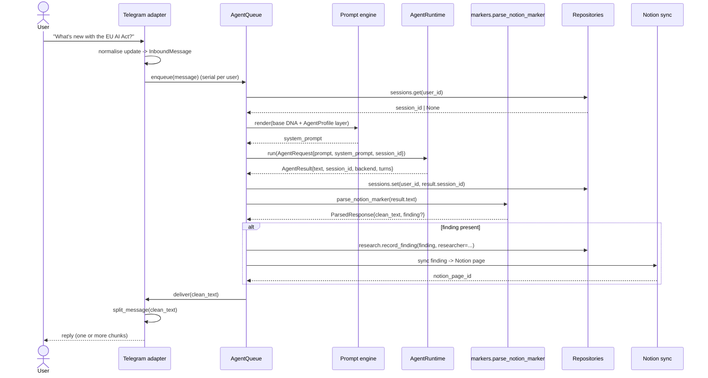
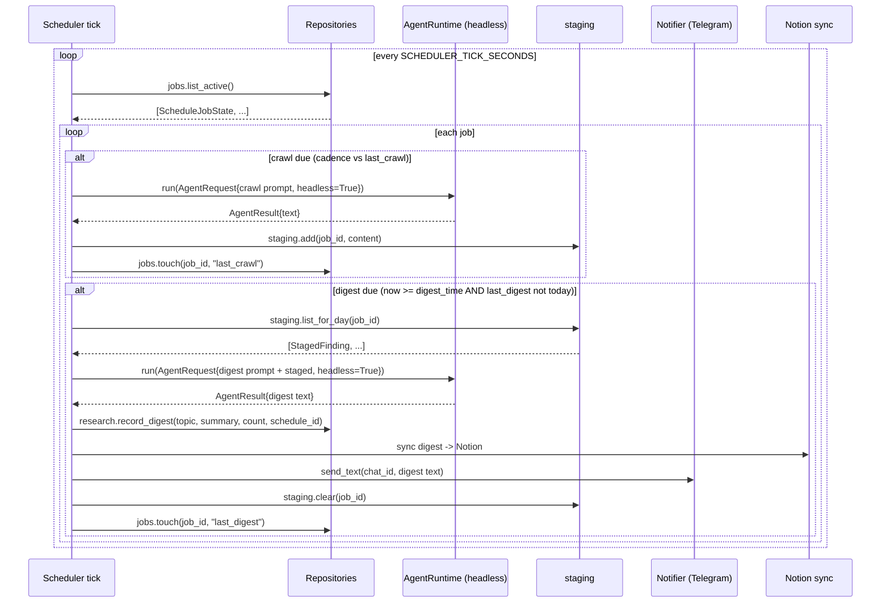

# Architecture

Gisst is a self-hosted, Claude-powered research agent that lives in Telegram, runs
scheduled research (the Watchout Protocol), and mirrors everything it learns into a
Notion knowledge base. This document explains how the pieces fit together, why the
boundaries fall where they do, and how a single request flows through the system.

The guiding idea is **one brain, many surfaces**: the agent core knows nothing about
Telegram, Notion, or HTTP. Those are adapters at the edges. Everything in the middle
speaks in framework-agnostic Pydantic models.

## Layered design

The package is organised as a dependency spine with adapters bolted onto the ends. A
module may only depend on layers below it. Nothing below depends on anything above.

```
                      composition root (app / __main__)
                                   wires everything
   ┌-------------------------------┴--------------------------------┐
   |                                                                 |
channel adapter            integration adapter            HTTP adapter
 (telegram/)                    (notion/)                    (api/)
   |                                |                          |
   └---------------┬----------------┴--------------┬-----------┘
                   |                                |
              agent runtime                     scheduler
            (agent/runtime, agent/             (scheduler/)
             prompt, queue, sessions)
                   |                                |
                   └---------------┬----------------┘
                                   |
                       core protocols + utilities
                        (core/: Notifier, split_message)
                                   |
                          domain models (models/)
                                   |
                       persistence spine (db/: engine,
                       ORM, repositories)
                                   |
            cross-cutting: config (config.py), constants
            (constants.py), logging (logging.py)
```

### The spine

- **`config.py`** - Typed settings loaded from the environment / `.env` via
  `pydantic-settings`. One cached accessor, `get_settings() -> Settings`. Each concern
  is its own nested group: `settings.telegram`, `settings.agent`, `settings.notion`,
  `settings.database`, `settings.scheduler`, `settings.api`, `settings.observability`.
  Derived paths (`.data_dir`, `.work_dir`, `.config_dir`, `.session_dir`,
  `.staging_dir`) and `ensure_dirs()` live here too. See
  [configuration.md](configuration.md) for the full env surface.
- **`constants.py`** - The handful of magic strings that must agree across subsystems:
  `NOTION_MARKER_TAG` (`[SAVE_TO_NOTION:`), `TELEGRAM_SPLIT_TARGET`, `NOTION_TEXT_LIMIT`,
  `DEFAULT_PROFILE_ID`, `DEFAULT_AGENT_NAME`, and the `NOTION_TYPE_*` row classifiers.
- **`logging.py`** - Structured logging via `structlog`. `configure_logging()` is
  idempotent and bridges stdlib logging (aiogram, httpx, apscheduler) into the same
  pipeline. `get_logger("subsystem.name")` returns a bound logger. Dev mode is pretty
  console output, prod (or `LOG_JSON=true`) is newline-delimited JSON.
- **`models/`** - The data contracts every subsystem speaks. `AgentProfile` and its
  parts (`AgentIdentity`, `ResearchSettings`, `InteractionSettings`, `ScheduleSettings`,
  `Tone`) describe the persona; `InboundMessage` / `OutboundMessage` / `ChatType` are the
  channel-agnostic message types; `ResearchFinding` / `ResearchSource` / `CrawlFinding`
  are research artefacts; `ScheduleJob` / `ScheduleJobState` / `StagedFinding` drive the
  scheduler; `StoredFinding` / `StoredDigest` are the read models the dashboard consumes.
- **`db/`** - The async persistence layer (SQLAlchemy 2.0 + aiosqlite). `Database` owns
  the engine and hands out commit-on-success sessions; `db/models.py` holds the ORM
  rows; `db/repositories.py` exposes domain-typed methods through the `Repositories`
  aggregate (`.sessions`, `.jobs`, `.staging`, `.research`, `.groups`, and `.stats()`).
  Callers never touch SQLAlchemy directly: repositories take and return Pydantic models
  and primitives, so a SQLAlchemy object never leaks past the repository boundary.

### Core protocols

`core/` holds cross-cutting contracts with no heavy dependencies:

- **`Notifier`** (Protocol) - `async send_text(chat_id, text) -> None`. Anything that
  can deliver plain text to a chat. Best-effort: implementations should not raise on a
  single failed chunk.
- **`split_message(text, max_length=TELEGRAM_SPLIT_TARGET)`** - Splits long text at the
  friendliest boundary under the limit (paragraph break, then line break, then space,
  hard-cut only as a last resort).

### Agent runtime

`agent/` is the brain. It is deliberately ignorant of every adapter:

- **`agent/runtime/`** - The `AgentRuntime` protocol (`.name`, `async run(AgentRequest)
  -> AgentResult`) and two interchangeable backends selected by `build_runtime`. See
  [agent-runtime.md](agent-runtime.md).
- **`agent/prompt`** - The two-layer prompt engine: a hardcoded base "DNA" layer plus a
  user layer rendered from the active `AgentProfile`, plus dedicated Watchout crawl /
  digest prompts.
- **`agent/queue`** - A per-user work queue. Messages for one user are processed
  sequentially (one session at a time, no concurrent calls to the same Claude session),
  while different users run in parallel.
- **`agent/sessions`** - Maps a user to their resumable Claude session id, persisted
  through `Repositories.sessions`.
- **`agent/markers.py`** - `parse_notion_marker(text) -> ParsedResponse(clean_text,
  finding)`. Extracts and validates the `[SAVE_TO_NOTION: {...}]` payload via a
  balanced-brace scan and strips it from the user-facing text.

### Adapters

Adapters translate between the outside world and the domain models:

- **`telegram/`** (channel) - Wraps aiogram. Normalises raw updates into
  `InboundMessage`, routes commands (`/start`, `/register`, `/schedule`, ...), and ships
  agent output back through a `TelegramNotifier` that implements the `Notifier`
  protocol and uses `split_message`.
- **`notion/`** (integration) - Wraps the Notion API. Auto-provisions the Research
  Findings and Daily Digests databases under the configured parent page on first boot,
  then syncs `ResearchFinding` / digest rows.
- **`api/`** (HTTP) - An optional, read-only FastAPI dashboard over the `Repositories`
  aggregate. See [api-dashboard.md](api-dashboard.md).

### Composition root

The entry point (`gisst.__main__` / the app builder) is the only place that knows about
every layer at once. It reads `get_settings()`, calls `ensure_dirs()`, configures
logging, builds the `Database` and `Repositories`, picks a runtime with `build_runtime`,
constructs the queue, starts the Telegram bot, starts the scheduler (injecting the
runtime, repositories, and a `Notifier`), and optionally launches the API. Wiring lives
in exactly one place; every other module receives its collaborators by constructor
injection.

## Component diagram



The two dotted edges are the important decoupling moves: the scheduler depends on the
`core.Notifier` protocol, never on `telegram/`, and the Telegram adapter *implements*
that protocol. The dependency arrow points the right way (`scheduler -> core.Notifier`,
not `scheduler -> telegram`), so the graph stays acyclic.

## Sequence: a user message

A user sends a research question in a registered Telegram chat. The reply comes back,
and any finding the agent decided to save lands in both SQLite and Notion.



Two details worth calling out:

- **Session continuity.** The queue passes the stored `session_id` into the request and
  writes back whatever the runtime resolves, so the next turn resumes the same Claude
  conversation (`--resume` for the CLI backend, replayed history for the SDK backend).
- **Marker parsing is above the runtime.** Backends only "talk to Claude". Extracting
  the save marker, persisting, and syncing to Notion all happen in the queue, so both
  backends behave identically.

## Sequence: a Watchout cycle

Scheduled research runs headless on a tick. Crawls accumulate into staging through the
day; once the digest time is at or past due (and no digest has fired yet today), the day's
findings are synthesised and delivered.



See [watchout-protocol.md](watchout-protocol.md) for cadence parsing and the exact
digest-timing rule.

## Three design decisions

### 1. Dual-runtime strategy

`AGENT_BACKEND` selects between two backends behind the single `AgentRuntime` protocol:

- **`cli`** - Shells out to the Claude Code CLI (`claude -p`), resuming sessions with
  `--resume`. Batteries included: native WebSearch / WebFetch, file tools, and
  CLI-managed session persistence. This is the default and the richest experience, ideal
  on a VM where the CLI is installed and logged in.
- **`api`** - A native Anthropic SDK tool-use loop (bounded by `AGENT_MAX_TURNS`), for
  deployments where the CLI is not available (containers, serverless, CI). It re-implements
  the search/fetch tools itself and replays history to emulate sessions.

Because both satisfy the same protocol and return the same `AgentResult`, the queue, the
scheduler, marker parsing, and Notion sync are written once and never branch on backend.
Swapping runtimes is a one-line env change. This keeps a hard dependency (a logged-in
CLI) optional instead of mandatory.

### 2. Notifier decoupling

The scheduler needs to deliver digests, but making `scheduler -> telegram` a hard
dependency would couple background research to one specific channel and risk an import
cycle. Instead the scheduler depends only on the narrow `core.Notifier` protocol
(`async send_text(chat_id, text)`), and `telegram/` provides a concrete
`TelegramNotifier`. The composition root injects it. The benefits:

- The dependency graph stays acyclic and the scheduler stays channel-agnostic.
- Adding a second channel (or a no-op notifier in tests) is a matter of providing
  another `Notifier` implementation, with zero scheduler changes.
- The scheduler can be unit-tested with a fake notifier that just records calls.

### 3. Why async SQLAlchemy replaced the JSON store

The original prototype kept everything in JSON files on disk (sessions, schedule jobs,
staging buffers, findings). That was fine for a demo and terrible for a long-running,
concurrent agent. The JSON store was replaced with an async SQLAlchemy 2.0 + aiosqlite
layer for concrete reasons:

- **Concurrency safety.** The bot, the scheduler, and the API all read and write at
  once. JSON files have no atomic read-modify-write, so a crawl finishing mid-write
  could corrupt the staging file. SQLite (in WAL mode, enabled per-connection by the
  `Database` wrapper) gives real transactional isolation, and every repository write
  runs inside a commit-on-success / rollback-on-error session.
- **Non-blocking I/O.** The whole app is async. File reads in JSON helpers block the
  event loop; `aiosqlite` does not.
- **Query-shaped access.** "active jobs", "the 50 most recent findings", "jobs for this
  chat", "staged findings for today" are one indexed query each, not a full-file load
  and in-memory filter.
- **A clean read-model boundary.** Repositories return `StoredFinding` / `StoredDigest`
  Pydantic models, so the dashboard and Notion sync never see ORM objects, and the
  storage engine can change without touching callers.
- **A real migration path.** Alembic with a deterministic constraint-naming convention
  (`db/base.py`) means schema changes are versioned and reversible, and the same code
  runs against Postgres by swapping `DATABASE_URL`.

The trade-off (a schema, migrations, and an ORM) is the deliberate "over-built"
foundation that lets the rest of the system stay simple.
