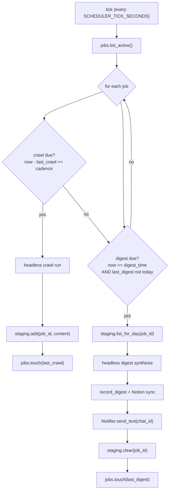

# Watchout Protocol

The Watchout Protocol is Gisst's scheduled-research engine. You point it at a topic and a
cadence; it crawls in the background through the day, accumulates findings in a staging
area, and at your chosen digest time it synthesises everything into one briefing and
delivers it to your Telegram chat (and to Notion, if configured).

Crawls run **headless** (no message triggers them, no user session is touched). They are
self-initiated by the scheduler on a fixed tick.

## How a job is defined

A job is a `ScheduleJobState` (`gisst.models.schedule`), persisted in the `schedule_jobs`
table and managed through `Repositories.jobs`. Its fields:

| Field | Default | Meaning |
| --- | --- | --- |
| `id` | uuid | Unique job id. `short_id` is the first 8 chars, used in commands. |
| `topic` | required | What to research. |
| `keywords` | `[]` | Extra search terms to focus the crawl. |
| `cadence` | `every 4h` | How often to crawl. |
| `digest_time` | `20:00` | Local wall-clock time to deliver the daily digest (`HH:MM`). |
| `digest_timezone` | `UTC` | Timezone for `digest_time`. |
| `lookback_window` | `24h` | How far back each crawl looks for "new" items. |
| `platform_priority` | `[]` | Preferred source domains (e.g. `reuters.com`, `arxiv.org`). |
| `active` | `True` | Paused jobs are skipped by the scheduler. |
| `chat_id` | required | Where the digest is delivered. |
| `created_by` | required | Who created the job. |
| `last_crawl` | `None` | Timestamp of the most recent crawl (drives cadence). |
| `last_digest` | `None` | Timestamp of the most recent digest (drives once-per-day). |

## The scheduler loop

The scheduler runs in the same process as the bot and is non-blocking. It wakes every
`SCHEDULER_TICK_SECONDS` (default 60). Each tick:

1. Loads active jobs via `Repositories.jobs.list_active()`.
2. For each job, decides independently whether a **crawl** is due and whether a **digest**
   is due.
3. Runs whichever are due, updating `last_crawl` / `last_digest` via `jobs.touch(...)`.

The whole tick is async, so a slow crawl never blocks the bot.



## Cadence parsing

`cadence` is a human string like `every 4h`, `every 30m`, `every 2 hours`, `daily`,
`hourly`. The scheduler parses it into an interval and compares `now - last_crawl`
against it:

- If `last_crawl` is `None`, the first crawl fires on the next due tick.
- Otherwise a crawl is due once the elapsed time since `last_crawl` is at least the
  cadence interval.

Because the check is "has enough time elapsed" rather than "is it exactly time T", a
slightly late tick still fires the crawl on the next pass. The lower bound on cadence
resolution is the tick interval: a cadence shorter than `SCHEDULER_TICK_SECONDS` is
effectively clamped to one crawl per tick.

## Crawl, staging, digest

### Crawl

When a crawl is due, the scheduler runs the runtime headless with the **crawl prompt**:
find what is new about `topic` (using `keywords`, biased toward `platform_priority`,
within `lookback_window`) and return structured findings. The result is appended to
staging via `Repositories.staging.add(job_id, content)`, which returns the running total
for the day.

### Staging

Staging is the buffer between crawls and the digest. It is partitioned by **job and day**
(`StagedFindingRow`, keyed by `job_id` + `day` as `YYYY-MM-DD`). Through the day, each
crawl appends a `StagedFinding(crawl_time, content)` row. At digest time,
`staging.list_for_day(job_id)` returns the day's findings ordered by crawl time, and
`staging.clear(job_id)` wipes that day's buffer once the digest has been delivered.

### Digest

When the digest is due, the scheduler loads the day's staged findings, runs the runtime
headless with the **digest prompt** (synthesise these into one coherent briefing), then:

- records it with `Repositories.research.record_digest(topic, summary, finding_count,
  schedule_id)`,
- syncs it to the Notion Daily Digests database (if Notion is enabled), storing the
  returned `notion_page_id`,
- delivers it to `chat_id` via the injected `Notifier` (`send_text`), which splits long
  text into Telegram-sized chunks,
- clears the staging buffer and touches `last_digest`.

## Digest timing: at-or-past-due, once per day

The digest fires when **both** conditions hold:

1. The current wall-clock time (in `digest_timezone`) is **at or past** `digest_time`.
2. No digest has already been sent **today** (`last_digest` is not today's date).

This "at-or-past" rule is deliberate and exists because of a real bug. The original
prototype used exact-minute matching:

```ts
// old, buggy
if (now.getHours() !== hours || now.getMinutes() !== minutes) return false;
```

If the scheduler tick landed at 20:01 instead of exactly 20:00, the digest never fired,
because the exact minute had already passed by the next tick. With a 60-second tick, any
jitter meant a permanent miss for the day. The fix compares total minutes and treats the
digest as due once the current time is at or past the target:

```ts
// fixed
const digestTotalMinutes = hours * 60 + minutes;
const currentTotalMinutes = now.getHours() * 60 + now.getMinutes();
if (currentTotalMinutes < digestTotalMinutes) return false;
```

The Python scheduler carries the same logic: at or past `digest_time`, and the
`last_digest != today` guard ensures it fires exactly once per day no matter how many
ticks happen after the target time. This is also why a job that is created after its
digest time still behaves sanely: it simply waits for the next day's window rather than
firing a half-empty digest immediately.

## The `/schedule` commands

Managed in the Telegram adapter, backed by `Repositories.jobs`:

| Command | Effect |
| --- | --- |
| `/schedule <topic> [every Xh] [digest HH:MM]` | Create a job for the current chat. Cadence and digest time are optional and fall back to the defaults (`every 4h`, `20:00`). Example: `/schedule EU AI Act every 4h digest 20:00`. |
| `/schedules` | List the jobs registered for this chat (`jobs.list_for_chat(chat_id)`), showing each `short_id`, topic, cadence, digest time, and active state. |
| `/pause <id>` | Toggle a job active/paused (`jobs.toggle`). Paused jobs are skipped by the loop. Accepts a short id prefix (`jobs.find_by_prefix`). |
| `/remove <id>` | Delete a job (`jobs.remove`). Accepts a short id prefix. |

Job ids are long uuids, so commands accept the 8-character `short_id` prefix and resolve
it via `find_by_prefix`.

## What lands where

| Destination | Content |
| --- | --- |
| Telegram chat (`chat_id`) | The synthesised digest text, chunked to fit. |
| Notion Daily Digests DB | One page per digest (topic, summary, finding count, schedule id link). |
| Local database | A `DigestRow` per digest and `FindingRow`s for findings; staging is cleared after delivery. |

Crawl findings accumulate quietly in staging and are never sent to the chat individually;
only the once-a-day digest is delivered, which is the whole point: continuous research,
one clean briefing.
